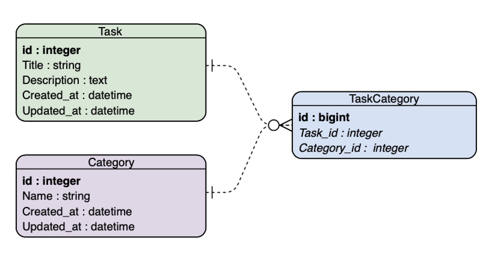
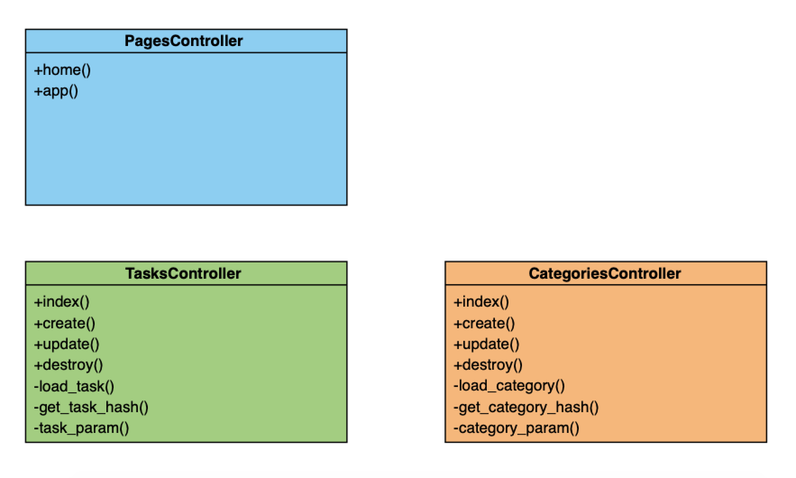
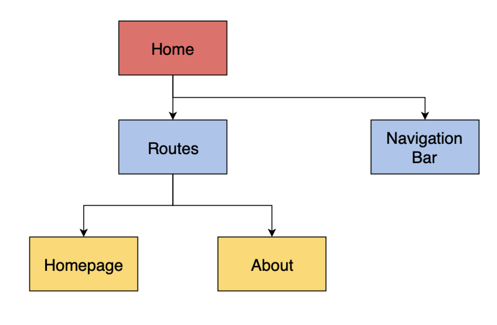
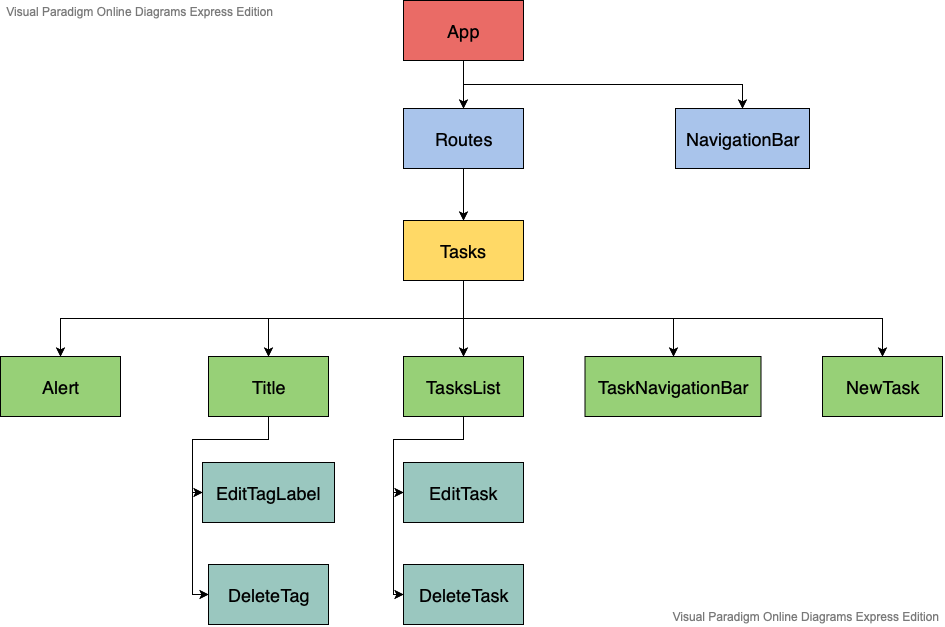

Hey there! This is the documentation for the app DoIt! It mainly consists of documentation on the architecture of the
system. Please refer to the documentation in the respective code file should you want to know more information about
a specific controller, React component, etc.

# Overall System Architecture
The application is built based on the Model-View-Controller (MVC) model, using **Ruby on Rails** as backend and
**React** as front-end. This is made possible by the [react-rails gem](https://github.com/reactjs/react-rails).

# Model
Below is the current database schema of the application. The Tasks and Categories table store all the tasks and
categories created by the user respectively. A task can have many categories and vice versa. This many-to-many
relationship is captured using the TaskCategories table. In terms of model, there are two models which support database
operations of the application, namely **Task** and **Category**.

The bold text and the italics text are the primary key and foreign key of a table respectively.

# Controller
Below are the controllers of the application.

* PagesController: Handles displaying of pages in the application, e.g. displaying the product website.
* TasksController: Handles Create, Update, Read, Delete (CRUD) operations of tasks. 
* CategoriesController: Handles CRUD operations of categories (tags).

If you are interested in the methods of the controller, you can refer to the documentation in the respective file of
the controller.

# View
There are 2 main views in the application, namely product website and application landing page. Diagrams below depicts
the structure of the 2 views mentioned in terms of their React components.

## Product Website
Product website is the [homepage](https://do-it-by-chris.herokuapp.com) of the application.

* Home: Parent component of the product website.
* Routes: A component which defines all the routes within the product website, e.g. homepage, about page.
* NavigationBar: The task bar at the top of the product website.
* Homepage, About: Homepage and about page respectively.

## Application Landing Page
Application landing page is the page which shows all the tasks.

* App: Parent component of the application.
* Routes: A component which defines all the routes within the application.
* NavigationBar: The tak bar at the top of the application.
* Task: The tasks page.
* Alert: An alert dialog which shows relevant messages to the user after performing certain actions, e.g. creating
a task.
* Title: The title of the page.
* EditTagLabel: A dialog which allows the user to edit the name of a category.
* DeleteTag: A dialog which allows the user to delete a category. 
* TasksList: The list of tasks shown in the tasks page.
* NewTask, EditTask, DeleteTask: A dialog which allows the user to create, edit, and delete a task respectively.
* TaskNavigationBar: The navigation bar of the tasks page.

Below are other important components which are not shown in the diagrams.
* TaskForm: A form which is used to create / edit a task.
* ConfirmationDialog: A dialog which asks for the user's confirmation.
* Modal: A general-purpose dialog which can be used by other components.

# Explanation of the Logic of Some Features
## Displaying All Tasks
The application first makes a client-side AJAX call to the server. The server then returns all the tasks created
by the user in JSON format. The application processes and stores all the tasks on the client-side which enables them
to be displayed.

## Displaying Tasks According to Tag
The application first fetches all the tasks from the server and store them. Then, using the specified tag, the
application filters the tasks according to the specified tag such that only tasks belong to the tag are displayed.

# Enquiry
Should you have any enquiry, please raise an issue for it in the project GitHub repository, thanks!