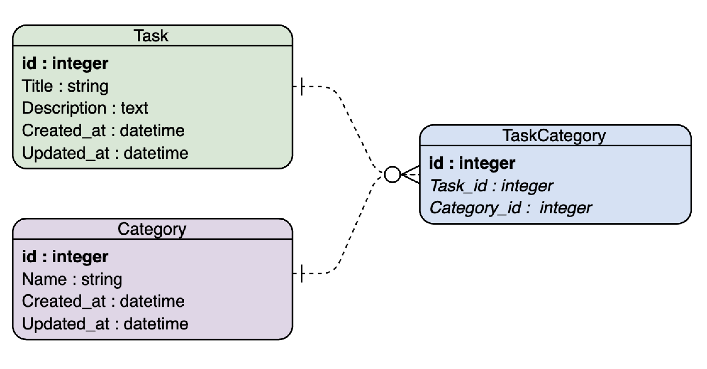

Hey there! This is the documentation for the app DoIt! It mainly consists of documentation on the architecture of the
system. Please refer to the documentation in the respective code file should you want to know more information about
a specific controller, React component, etc.

## Overall System Architecture
The application is built using Ruby on Rails as backend and React as front-end, following the Model-View-Controller (MVC)
model. This is enable by the [react-rails gem](https://github.com/reactjs/react-rails). Below is an picture which depicts this.

// MVC picture here with Rails and React 

## Model
Below is the current database schema of the application. In terms of model, there are two models which support the
database operation, namely **Task** and **Category**.

## Controller

* PagesController: Handles displaying of pages in the application.
* TasksController: Handles Create, Update, Read, Delete (CRUD) operations of tasks. 
* CategoriesController: Handles CRUD operations of categories (tags).

## View
View of the application is written using React. There are 2 main views of the application, namely product website and application landing page. Diagrams below depicts the structure of the 2 views mentioned.

### Product Website

### Application Landing Page

* TaskForm: a form element which is used to create / edit a task.